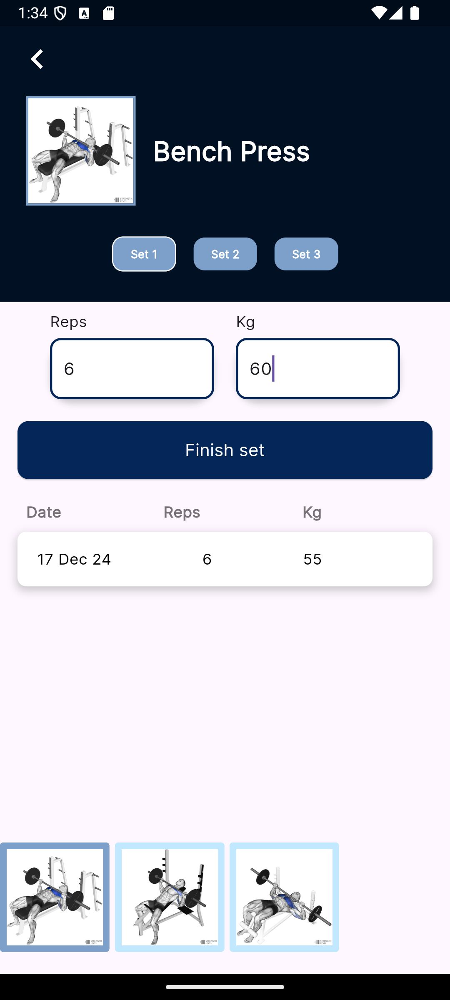
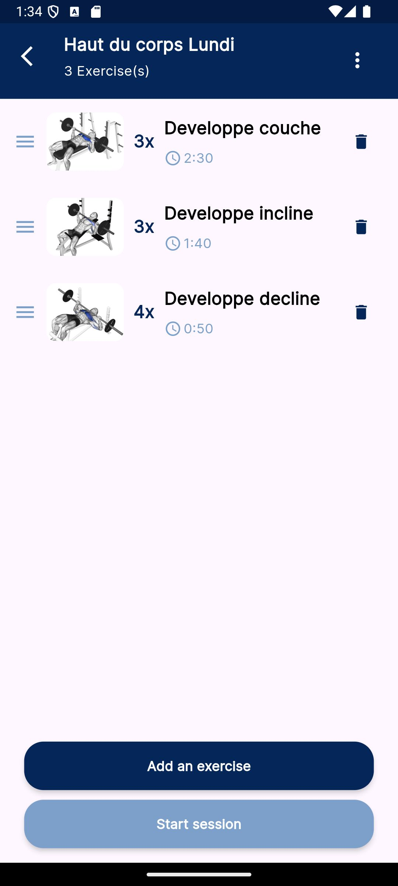

# my_fit_buddy

MyFitBuddy, « la prise de notes sans prise de tête ».

1) Planifiez vos séances personnalisées en choisissant vos exercices, le poids, le nombre de répétitions et les temps de repos.
2) Durant la séance, MyFitBuddy vous accompagne grâce au programme enregistré et à son minuteur à chaque étape.
3) Après le sport, vous pourrez noter vos ressentis et ainsi ajuster votre programme selon vos besoins ou identifier des surcharges avant votre prochaine séance. Vous pourrez également consulter votre historique par type de séance ou par exercice.

⏱️ Gain de temps à la salle, terminées les longues minutes de réflexion devant un appareil ou entre deux exercices.
📈 L’évolution de vos performances est visible, ce qui renforce la motivation.
🏅 Permet de progresser plus rapidement. 100% des sportifs qui prennent des notes observent une amélioration de leurs performances.

<div style="display:flex; width:100%; justify-content:space-around">
    
    
</div>


## L'application Back-end
<a href="https://github.com/BaptisteGosselet/my_fit_buddy_back">Github : MyFitBuddy Back</a>

## Lancer le projet

1. Récupérer les dépendances 
```sh
flutter pub get
```

2. Générer les fichiers de traduction (qui se trouveront dans `lib/l10n/`).
```sh
flutter gen-l10n
```

3. Mettre en place un émulateur 

Lister les émulateurs disponibles : 
```sh
flutter emulators
```
Et lancer l'émulateur trouvé : 
```sh
flutter emulators --launch $nom_de_l_emulateur
``` 

Par exemple : `flutter emulators --launch Medium_Phone_API_35`

4. Configurer la BASE_URL du Back-end dans le fichier `lib/core/config.dart`.

5. Lancer le projet sur l'émulateur

```sh
flutter run
```

# Qualité de code

1. Pour formatter le code (indentations, sauts de lignes, etc.)
```sh
dart format . # à la racine du projet
```
2. Analyse des bonnes pratiques
```sh
flutter analyze
```
